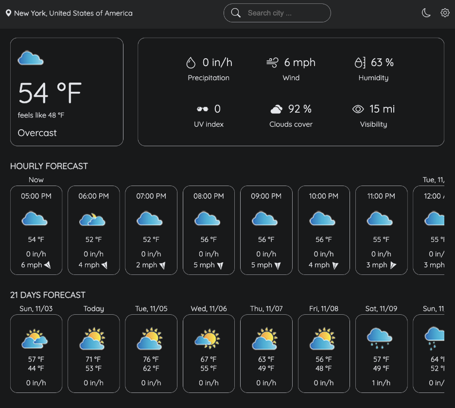

# React Weather Application
## Overview
The React Weather Application is an interactive dashboard built with React.js that provides real-time weather information for any selected location. It features current weather conditions, hourly and daily forecasts, and supports multiple measurement systems (e.g., metric and imperial). By integrating the Meteosource Weather API, the app fetches detailed weather data, such as temperature, humidity, wind speed, UV index, and cloud coverage. This project highlights how to seamlessly integrate third-party APIs into a modern web application.


## Objectives
1. Build a responsive and user-friendly weather application for global users.
2. Integrate a third-party weather API to fetch accurate weather data.
3. Enhance user experience with features like light/dark mode, multi-unit support, and interactive weather displays.
4. Implement reusable and modular components for easier maintenance and scalability.

## Technologies and Frameworks
- **React**: Core framework for building the frontend.
- **Meteosource Weather API**: Weather data provider for forecasts and conditions.
- **CSS Modules**: For styling and ensuring scoped and maintainable CSS.
- **React Context API**: Manages global states such as theme and weather data.
- **JavaScript**: Implements dynamic functionalities and interactions.

## Features
- Current Weather Display: Shows the current weather conditions, including temperature, humidity, wind speed, and more.
- Hourly Weather Forecast: Provides detailed hourly weather forecasts for the selected location.
- Daily Weather Forecast: Displays a 21-day weather forecast for the selected location.
- Measurement System: Automatically adjusts units (e.g., Celsius/Fahrenheit) based on the user's manual selection.
- Light/Dark Mode: Automatically adjusts between light and dark themes based on user's manual selection.
- HorizontallyScrollable.js: Enables horizontal scrolling for displaying weather forecasts.

## How to Build and Run
#### Prerequisites
To fetch weather data, users must obtain a Meteosource Weather API key and store it in a .env file, naming the variable **REACT_APP_API_KEY**.

#### Steps
1. Clone the Repository

2. Install Dependencies:
    ```bash
    npm install
    ```
3. Start the Application:
    ```bash
    npm start
    ```
4. Access the App: 
    Open http://localhost:3000 in your browser.

## Results
1. Delivered a fully functional weather application with an intuitive user interface.
2. Successfully integrated real-time weather data for accurate and dynamic updates.
3. Enhanced user engagement through light/dark themes and customizable measurement units.

## Conclusion
The React Weather Application demonstrates the integration of third-party APIs with React.js to build a dynamic, responsive, and user-friendly web application. It showcases the use of reusable components, state management with Context API, and customizable features for better user experience.

## Future Work
1. Geo-Location Support: Automatically detect user location for weather updates.
2. Offline Mode: Cache the last fetched data to display weather information offline.
3. Additional APIs: Integrate AQI (Air Quality Index) and weather alerts.
4. Mobile App Extension: Build a mobile app version using React Native for cross-platform availability.

